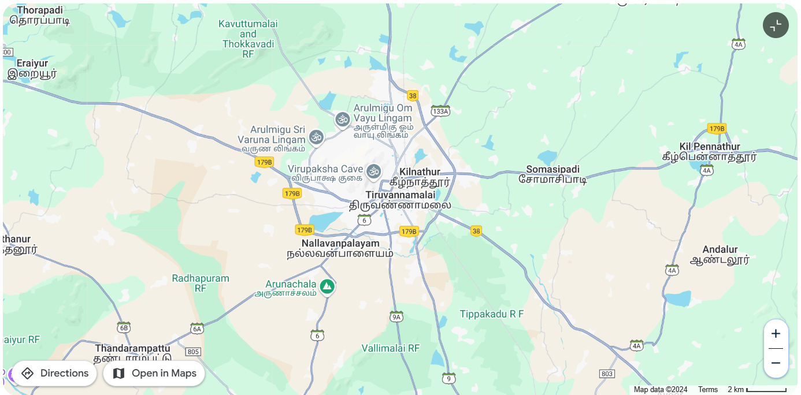

# Ex04 Places Around Me
## Date: 05/12/2024

## AIM
To develop a website to display details about the places around my house.

## DESIGN STEPS

### STEP 1
Create a Django admin interface.

### STEP 2
Download your city map from Google.

### STEP 3
Using ```<map>``` tag name the map.

### STEP 4
Create clickable regions in the image using ```<area>``` tag.

### STEP 5
Write HTML programs for all the regions identified.

### STEP 6
Execute the programs and publish them.

## CODE
"""
# 1.city:
<html>
    <head>
        My City
    </head>
    <body>
        <h1 align = "center">
            <font color="red"><b>Thiruvannamalai</b></font>
        </h1>
        <h3 align="center">
            <font color="blue"><b>Surya (24901185)</b></font>
        </h3>
        <center>
            
            <map name="MyCity">
                <area shape="rect" coords="770,339,618,310" title="Home Town" href="home.html">
                <area shape="rect" coords="629,299,509,263" title="Cave" href="cave.html">
                <area shape="rect" coords="584,177,705,245" title="lingam" href="lingam.html">
                <area shape="rect" coords="570,494,441,443" title="arunachalam" href="mountain.html">
            </map>
        </center>
    </body>
    
</html>

# 2.Home:

<html>
    <body style="background-color: antiquewhite;">
        <b>About District</b><br>
Tiruvannamalai is one of the most venerated places in Tamil Nadu. In ancient times, the term “Annamalai” meant an inaccessible mountain. The word “Thiru” was prefixed to signify its greatness, and coupled with the two terms, it is called Tiruvannamalai.
The Temple Town of Tiruvannamalai is one of the most ancient heritage sites of India and is a centre of the Saiva religion. The Arunachala hill and its environs have been held in great regard by the Tamils for centuries. The temple is grand in conception and architecture and is rich in tradition, history and festivals. The main Deepam festival attracts devotees from far and wide throughout South India. It has historic places besides Tiruvannamalai, Arni, Vandavasi, Devigapuram connected to East India and French companies. In the late Chola period this district was ruled by the Cholan of Sambuvarayar having Padavedu near Arni as HQ. We can now find the fort and note along with a Shiva temple namely Kailasanathar in Arni town.<br>
<br>
<b>Administrative Units</b><br>
Tiruvannamalai District was created from erstwhile North Arcot District on 30-09-1989. The  district is surrounded by Kanchipuram district in the East, Villupuram district in the south, Dharmapuri and Krishnagiri Districts in the West and Vellore District in the North as its boundaries. Tiruvannamalai District is divided into 3 Revenue Divisions namely Tiruvannamalai, Arni and Cheyyar and  12 Taluks namely Tiruvannamalai, Kilpennathur, Chengam, Thandarampattu, Kalasapakkam Polur, Arni, Chetput, Cheyyar, Vembakkam, Vandavasi and Jamanamarathur. They are further sub-divided into 18 development blocks, 4 Municipalities and 10 Town Panchayats and 860 Village Panchayats.<br>
<br>
<b>Location</b><br>
Tiruvannamalai District is located in the Northern part of Tamilnadu with a distance of 190 km from Chennai and 210 km from Trichy.<br>
<br>
<b>Agriculture</b><br>
Tiruvannamalai District is leading producer of Rice.  The quality rice produced from Arni region is being exported to throughout Tamil Nadu and to other States of India and foreign countries. Thinai, Samai and Varagu millets, Seetha and Jackfruit are producing in Jawadhu hills. Banana plantation is widely practiced in Padavedu region. Approximately 56 % of people are depended on Agriculture related works.<br>
<br>
<b>Industries</b><br>
Tiruvannamalai district is a backward district in terms of Industrial production. Agricultural based industries like Sugar mills are situated in Polur, Cheyyar and Kozhunthampattu. The Lakshmi Saraswathy Cotton mill is functioning at Sevur near Arni. Cheyyar SIPCOT industrial estate is famous for production of finished leather goods and automobile accessories and provides more employment opportunity for the people in the North eastern part of this district. Apart from these, Granite industries make Black Stones, Colored Stones and soft stones.<br>
<br>
<b>Tourism</b><br>
Tiruvannamalai District is famous for spiritual and religious aspect. The world famous Annamalaiyar temple, Padavedu Renugammbal temple, Thennnagur Pandurangar Temple and Devikapuram Periyanayagi amman temple are some of the main spiritual centers.  Sathanur Dam, Jawadhu Hills are the famous tourist places. Tirumalai Jain temple, Mamandur cave temples, Koolamandal and Brammadesam are the heritage sites of this district.<br>
<br>
<b>Education</b><br>
Tiruvannamalai District is divided into 5 educational district viz Tiruvannamalai, Arni, Cheyyar, Chengam and Polur comprising a total of 1798 primary schools, 219 Highschools,160 Higher Secondary School apart from CBSE schools are functioning in the district. Forest Department schools with hostel facilities are running for tribal people in Jawadhu hills.<br><br>

<b>Health</b><br>
There are 417 Health Sub Centers and 114 Primary Health Centers and 20 Hospitals and one Government Medical College are funtioning for the service of people under the control of Public Health Department. Five vetinary hospitals and 113 dispensaries are functioning under the control of Animal Husbandry Department.<br>
    </body>
</html>

# 3.Cave:

<html>
    <body style="background-color: bisque;">
        Ramana Maharshi (Sanskrit pronunciation: [ˈɾɐ.mɐ.ɳɐ mɐˈɦɐɾ.ʂi], in tamil: இரமண மகரிசி, Iramaṇa Makarici; 30 December 1879  14 April 1950) was an Indian Hindu sage and jivanmukta (liberated being). He was born <b>Venkataraman Iyer</b>, but is mostly known by the name Bhagavan Sri Ramana Maharshi.

He was born in Tiruchuli, Tamil Nadu, India in 1879. In 1895, an attraction to the sacred hill Arunachala and the 63 Nayanmars was aroused in him, and in 1896, at the age of 16, he had a "death-experience" where he became aware of a "current" or "force" (avesam) which he recognized as his true "I" or "self",and which he later identified with "the personal God, or Iswara", that is, Shiva. This resulted in a state that he later described as "the state of mind of Iswara or the jnani". Six weeks later he left his uncle's home in Madurai, and journeyed to the holy mountain Arunachala, in Tiruvannamalai, where he took on the role of a sannyasin (though not formally initiated), and remained for the rest of his life.

He attracted devotees that regarded him as an avatar of Shiva and came to him for darshan ("the sight of God"). In later years, an ashram grew up around him, where visitors received upadesa ("spiritual instruction") by sitting silently in his company or by asking questions. Since the 1930s his teachings have been popularized in the West.

Ramana Maharshi approved a number of paths and practices,but recommended self-enquiry as the principal means to remove ignorance and abide in self-awareness,together with bhakti (devotion) or surrender to the Self.
    </body>
</html>

# 4.lingam:

<html>
    <body style="background-color: azure;">
        Arunachalesvara Temple (also called Annamalaiyar Temple), is a Hindu temple dedicated to the god Shiva, located at the base of Arunachala hill in the town of Tiruvannamalai in Tamil Nadu, India. It is significant to the Hindu sect of Shaivism as one of the temples associated with the five elements, the Pancha Bhuta Sthalas, and specifically the element of fire, or Agni.

Shiva is worshiped as Arunachalesvara or Annamalaiyar, and is represented by the lingam, with his idol referred to as Agni lingam. His consort Parvati is depicted as Unnamalai Amman.The presiding deity is revered in the 7th century CE Tamil Saiva canonical work, the Tevaram, written by Tamil saint poets known as the Nayanars and classified as Paadal Petra Sthalam. The 9th century CE Shaiva saint poet Manikkavacakar composed the Tiruvempavai here.

The temple complex covers 10 hectares, and is one of the largest in India.It houses four gateway towers known as gopurams. The tallest is the eastern tower, with 11 stories and a height of 66 metres (217 ft), making it one of the tallest temple towers in India built by Sevappa Nayakar (Nayakar dynasty)The temple has numerous shrines, with those of Arunachalesvara and Unnamalai being the most prominent. The temple complex houses many halls; the most notable is the thousand-pillared hall built during the Vijayanagara dynasty.

The present masonry structure was built during the Chola dynasty in the 9th century CE, while later expansions are attributed to Vijayanagara rulers of the Sangama Dynasty (1336–1485 CE), the Saluva Dynasty and the Tuluva Dynasty (1491–1570 CE). The temple is maintained and administered by the Hindu Religious and Charitable Endowments Department of the Government of Tamil Nadu.

The temple has six daily rituals at various times from 5:30 a.m. to 10:00 p.m., and twelve yearly festivals on its calendar. The Karthika Deepam festival is celebrated during the day of the full moon between November and December, and a huge beacon is lit atop the hill. It can be seen from miles around, and symbolizes the Shiva lingam of fire joining the sky.The event is witnessed by three million pilgrims. On the day preceding each full moon, pilgrims circumnavigate the temple base and the Arunachala hills in a worship called Girivalam, a practice carried out by one million pilgrims yearly.
    </body>
</html>

# 5.Mountain:

<html>
    <body style="background-color: aqua;">
        Arunachala (IAST: Aruṇācalam [əɾʊˈɳaːtʃələ], 'Red Mountain') is a hill in Tiruvannamalai district, Tamil Nadu, and one of the five main Shaiva holy places in South India.The Arunachalesvara Temple to Shiva is located at the base of the hill.The hill is also known by the names Annamalai, Arunagiri, Arunachalam, Arunai, Sonagiri, and Sonachalam.

Every year in the Tamil month of Kārttikai (November–December), the Kārttikai tīpam light is lit atop the hill.

It is also an important place for devotees of Ramana Maharshi, with Sri Ramana Ashram situated at its foothills.

References in religious texts
According to the legend, associated with the Temple, a dispute occurred between Brahma the creator, and Vishnu the preserver, over which of them was superior. In order to settle the argument, Lord Shiva is said to have manifested as a column of light, and then the form of Arunachala.But Brahma and Vishnu forgot their highest sacred duties and competed with each other. To solve this, Lord Shiva got up to test the heavens and the earth, saying that the one who sees his head and feet is the greatest among you. Brahma and Vishnu, no matter how hard they tried, failed miserably. Following this, the Devas, who could not bear the heat, prayed to Lord Shiva for peace. Lord Shiva, in response to their request, bowed down to a mountain and a small torch appeared on top of it, and everyone worshiped. The place is also known as Thiruvannamalai, also known as Arunachalam, the site of the fire. The Karthika lamp is mounted on this hill every year during the month of Karthika. Tens of thousands of people flock to Thiruvannamalai on that day.
    </body>
</html>

"""


## OUTPUT

1.

2.

3.

4.

5.
## RESULT
The program for implementing image maps using HTML is executed successfully.
